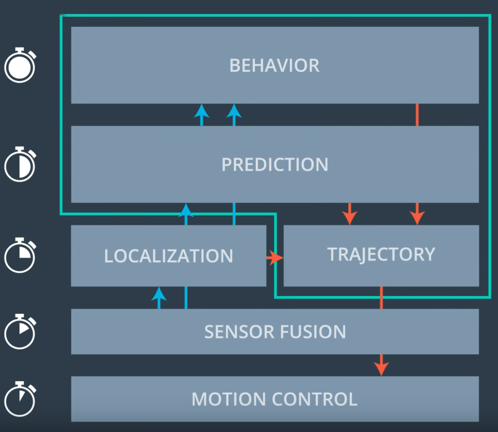
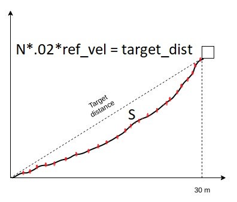

# CarND-Path-Planning-Project
[](http://www.udacity.com/drive)

In this project our goal is to safely navigate around a virtual highway with other traffic that is driving +-10 MPH of the 50 MPH speed limit. You will be provided the car's localization and sensor fusion data, there is also a sparse map list of waypoints around the highway. The car should try to go as close as possible to the 50 MPH speed limit, which means passing slower traffic when possible, note that other cars will try to change lanes too. The car should avoid hitting other cars at all cost as well as driving inside of the marked road lanes at all times, unless going from one lane to another. The car should be able to make one complete loop around the 6946m highway. Since the car is trying to go 50 MPH, it should take a little over 5 minutes to complete 1 loop. Also the car should not experience total acceleration over 10 m/s^2 and jerk that is greater than 10 m/s^3.

## Reflection



Path planning consist of prediction, behaviour planning, and trajectory generation.

### Prediction
The prediction component estimates what actions other objects might take in the future. For example, if another vehicle were identified, the prediction component would estimate its future trajectory.

#### Input of the prediction module from sensor fusion example
```
{
    "timestamp" : 34512.21,
    "vehicles" : [
        {
            "id"  : 0,
            "x"   : -10.0,
            "y"   : 8.1,
            "v_x" : 8.0,
            "v_y" : 0.0,
            "sigma_x" : 0.031,
            "sigma_y" : 0.040,
            "sigma_v_x" : 0.12,
            "sigma_v_y" : 0.03,
        },
        {
            "id"  : 1,
            "x"   : 10.0,
            "y"   : 12.1,
            "v_x" : -8.0,
            "v_y" : 0.0,
            "sigma_x" : 0.031,
            "sigma_y" : 0.040,
            "sigma_v_x" : 0.12,
            "sigma_v_y" : 0.03,
        },
    ]
}
```
#### Output of the prediction module example

```
{
    "timestamp" : 34512.21,
    "vehicles" : [
        {
            "id" : 0,
            "length": 3.4,
            "width" : 1.5,
            "predictions" : [
                {
                    "probability" : 0.781,
                    "trajectory"  : [
                        {
                            "x": -10.0,
                            "y": 8.1,
                            "yaw": 0.0,
                            "timestamp": 34512.71
                        },
                        {
                            "x": -6.0,
                            "y": 8.1,
                            "yaw": 0.0,
                            "timestamp": 34513.21
                        },
                        {
                            "x": -2.0,
                            "y": 8.1,
                            "yaw": 0.0,
                            "timestamp": 34513.71
                        },
                        {
                            "x": 2.0,
                            "y": 8.1,
                            "yaw": 0.0,
                            "timestamp": 34514.21
                        },
                        {
                            "x": 6.0,
                            "y": 8.1,
                            "yaw": 0.0,
                            "timestamp": 34514.71
                        },
                        {
                            "x": 10.0,
                            "y": 8.1,
                            "yaw": 0.0,
                            "timestamp": 34515.21
                        },
                    ]
                },
                {
                    "probability" : 0.219,
                    "trajectory"  : [
                        {
                            "x": -10.0,
                            "y": 8.1,
                            "yaw": 0.0,
                            "timestamp": 34512.71
                        },
                        {
                            "x": -7.0,
                            "y": 7.5,
                            "yaw": -5.2,
                            "timestamp": 34513.21
                        },
                        {
                            "x": -4.0,
                            "y": 6.1,
                            "yaw": -32.0,
                            "timestamp": 34513.71
                        },
                        {
                            "x": -3.0,
                            "y": 4.1,
                            "yaw": -73.2,
                            "timestamp": 34514.21
                        },
                        {
                            "x": -2.0,
                            "y": 1.2,
                            "yaw": -90.0,
                            "timestamp": 34514.71
                        },
                        {
                            "x": -2.0,
                            "y":-2.8,
                            "yaw": -90.0,
                            "timestamp": 34515.21
                        },
                    ]

                }
            ]
        },
        {
            "id" : 1,
            "length": 3.4,
            "width" : 1.5,
            "predictions" : [
                {
                    "probability" : 1.0,
                    "trajectory" : [
                        {
                            "x": 10.0,
                            "y": 12.1,
                            "yaw": -180.0,
                            "timestamp": 34512.71
                        },
                        {
                            "x": 6.0,
                            "y": 12.1,
                            "yaw": -180.0,
                            "timestamp": 34513.21
                        },
                        {
                            "x": 2.0,
                            "y": 12.1,
                            "yaw": -180.0,
                            "timestamp": 34513.71
                        },
                        {
                            "x": -2.0,
                            "y": 12.1,
                            "yaw": -180.0,
                            "timestamp": 34514.21
                        },
                        {
                            "x": -6.0,
                            "y": 12.1,
                            "yaw": -180.0,
                            "timestamp": 34514.71
                        },
                        {
                            "x": -10.0,
                            "y": 12.1,
                            "yaw": -180.0,
                            "timestamp": 34515.21
                        }
                    ]
                }
            ]
        }
    ]
}
```
This example only shows vehicles but in reality we would also generate predictions for all dynamic objects in view.

In the prediction lecture, we are gone through, model, data drivien, and hybrid approach for prediction which can be useful for more complex scenarios. In data driven based approach where camera used to collect the data and train the model on it. Then predict the trajectories of the vehicle. In model based approach, we define the process model of each scenarios(left, right, and straight), then use multimodel algorithm to predict the trajectories of the vehicles that consist of t time t+1 time result. Both apparach has pros and cons. The combination of these two can have powerful features. In hybrid approach, multimodel alogorithm gets replace with a machine learning algorithm. One of such a algorthm is called naive bayes classifier.

As we see above, actual prediction module gives the possible trajectories from the current timeline to the future of each vehicle. In this highway exmaple, we will have only one possible trajectory for each vehicle and we are using simple approach for predictio here. In complex situation we may need to use model, data, or hybrid approach for prediction module.

Currently we assume that we have only three lanes and each lane has 4 meter width. In actual scenarion, number of lanes, distance between the lanes, and total lanes distance can be detected using computer vision technologies. We slightly touched in advanced lane findings in term1. 

As we are using simple prediction technique where following parameter set to true is any of the vehicles sourrounding to ego vehicle within the limit.

```
bool car_ahead = false;
bool car_left = false;
bool car_right = false;
```

Then we have to find out which of the line these car located.
```
if(d > 0 && d < 4) {
    check_car_lane = 0;
} else if(d > 4 && d < 8) {
    check_car_lane = 1;
} else if(d > 8 and d < 12) {
    check_car_lane = 2;
} 
```

Finally we have to set the above flags to true or false based on the car location to ego vehicle.
```
if(check_car_lane == lane) {
    //A vehicle is on the same line and check the car is in front of the ego car
    car_ahead |= check_car_s > car_s && (check_car_s - car_s) < 30;										

} else if((check_car_lane - lane) == -1) {
    //A vehicle is on the left lane and check that is in 30 meter range
    car_left |= (car_s+30) > check_car_s  && (car_s-30) < check_car_s;

} else if((check_car_lane - lane) == 1) {
    //A vehicle is on the right lane and check that is in 30 meter range
    car_right |= (car_s+30) > check_car_s  && (car_s-30) < check_car_s;

}
```

car_s is provided by the simulator and where the vehicle will be in future is computed using below code.

```
check_car_s += ((double)prev_size*0.02*check_speed);
```

### Behaviour planning
The behavioral planning component determines what behavior the vehicle should exhibit at any point in time. For example stopping at a traffic light or intersection, changing lanes, accelerating, or making a left turn onto a new street are all maneuvers that may be issued by this component. Behavior planner takes the input of maps, route and predictions about what other vehicles are likely to do and suggest the trajectory module to create trajectory based on the suggestion from the behavior planner.

In actual case, behaviour planner decides the trajectory based on the cost functions. In this highway example, we may no need to worry about cost functions as we are considering only lane change or reduce speed based on the obstacles. 

Prediction set three flags(car_ahead, car_left, and car_right) according to the sensor fusion data.In the behavior planner as shown in the code below, it check for the car_ahed flag set to true. If it is, then it will execute the rest of the code to make the decision to turn left, turn right, or reduce the speed.

```
if(car_ahead) {
    if(!car_left && lane > 0) {
        lane--;
    } else if(!car_right && lane !=2) {
        lane++;
    } else if(!car_left && lane !=2) {
        lane++;
    }else {
        ref_vel -= speed_diff;
    }
} else if(ref_vel < max_accel){
    ref_vel += speed_diff;
}
```

If the car is not ahead and velocity is not same as max_accel, then it will increse the speed by small difference during each check.

### Trajectory generation
Based on the desired immediate behavior, the trajectory planning component will determine which trajectory is best for executing this behavior.

Trajectory generation code is inspired from project code walk through in course. It strats with finding any previous points.

```
int prev_size = previous_path_x.size();
```
we keep the refence x,y and yaw points.
```
double ref_x = car_x;
double ref_y = car_y;
double ref_yaw = deg2rad(car_yaw);
```

Checking any previous points left and it is almost empty, then we use current car's point to find the previous point and add them to the list.
```
if ( prev_size < 2 ) {

    //Use two points thats makes path tangent to the car
    double prev_car_x = car_x - cos(car_yaw);
    double prev_car_y = car_y - sin(car_yaw);

    ptsx.push_back(prev_car_x);
    ptsx.push_back(car_x);

    ptsy.push_back(prev_car_y);
    ptsy.push_back(car_y);
} 
```
If there is already previous points, then we just add previous two points. Also we are defininf last know previous point to reference x and y.
```
//Redefine the reference point to previous point
ref_x = previous_path_x[prev_size - 1];
ref_y = previous_path_y[prev_size - 1];

double ref_x_prev = previous_path_x[prev_size - 2];
double ref_y_prev = previous_path_y[prev_size - 2];
ref_yaw = atan2(ref_y-ref_y_prev, ref_x-ref_x_prev);

ptsx.push_back(ref_x_prev);
ptsx.push_back(ref_x);

ptsy.push_back(ref_y_prev);
ptsy.push_back(ref_y);
```

Now we need to add 3 future points to ptsx, psy vecotrs. as car_s is frenet and we need to conver to the global x,y coordinates using getXY function. In total ptsx, ptsy has got 5 points in total each.
```
vector<double> next_wp0 = getXY(car_s + 30, 2 + 4*lane, map_waypoints_s, map_waypoints_x, map_waypoints_y);
vector<double> next_wp1 = getXY(car_s + 60, 2 + 4*lane, map_waypoints_s, map_waypoints_x, map_waypoints_y);
vector<double> next_wp2 = getXY(car_s + 90, 2 + 4*lane, map_waypoints_s, map_waypoints_x, map_waypoints_y);

ptsx.push_back(next_wp0[0]);
ptsx.push_back(next_wp1[0]);
ptsx.push_back(next_wp2[0]);

ptsy.push_back(next_wp0[1]);
ptsy.push_back(next_wp1[1]);
ptsy.push_back(next_wp2[1]);
```

For trajectory generation, we are using spline instead of polynomial trajectory generation. One of the reason is it is simple to use and requiring no dependencies. once we intialise the spline with ptsx and ptsy.
```
tk::spline s;
s.set_points(ptsx, ptsy);
```

Then we add all previous points to next_x_vals and next_y_vals as it going to be the final control values pass it to the simulator and it will helps to get a smooth transition to the new points that we calculate later.
```
vector<double> next_x_vals;
vector<double> next_y_vals;
//For the smooth transition, we are adding previous path points
for ( int i = 0; i < prev_size; i++ ) {
    next_x_vals.push_back(previous_path_x[i]);
    next_y_vals.push_back(previous_path_y[i]);
}
```

Now we need to find the all spline points till the horizon(say 30m) value so that spacing the way that ego car can travel at desired speed. Remeber the speed of the car is depend on the spacing between the points. If we know x point(ie 30m in this case), spline will be able to get us correponding spline y points.

```
double target_x = 30.0;
double target_y = s(target_x);
double target_dist = sqrt(target_x*target_x + target_y*target_y);
```

We can calculate the spline points from start to horizon y points by using the formula mentioned in the picture. Our number of points has to be calculated is 50. We already added remaining previous points to the vectors next_x_vals and next_y_vals. We need to get the spline points of 50-previous_points.

```
for( int i = 1; i < 50 - prev_size; i++ ) {
              
    double N = target_dist/(0.02*ref_vel/2.24);
    double x_point = x_add_on + target_x/N;
    double y_point = s(x_point);

    x_add_on = x_point;

    double x_ref = x_point;
    double y_ref = y_point;

    //Rotate back to normal after rotating it earlier
    x_point = x_ref * cos(ref_yaw) - y_ref * sin(ref_yaw);
    y_point = x_ref * sin(ref_yaw) + y_ref * cos(ref_yaw);

    x_point += ref_x;
    y_point += ref_y;

    next_x_vals.push_back(x_point);
    next_y_vals.push_back(y_point);
}
```

next_x_vals and next_y_vals now have all 50 points which consist of 3 future points and 47 previous points.


